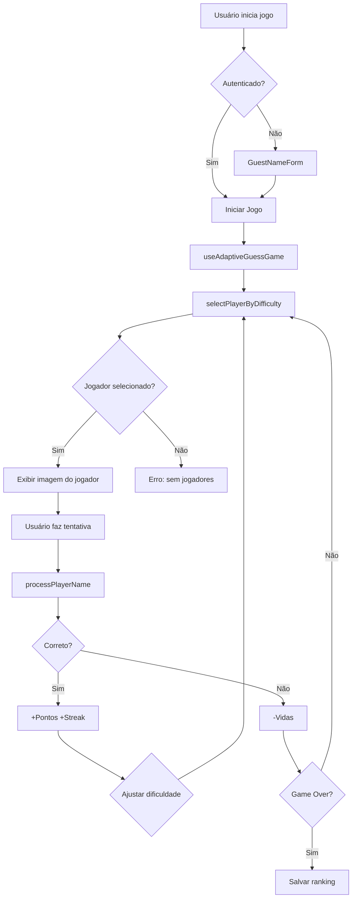

# 🤖 Guia para IA - Lendas do Flu

> **Objetivo**: Este documento facilita a compreensão rápida do projeto para IAs que farão manutenção e evolução do código.

## 📋 Visão Geral do Projeto

**Lendas do Flu** é um jogo de quiz interativo sobre jogadores históricos do Fluminense Football Club. O jogador vê uma imagem de um jogador histórico e precisa adivinhar seu nome, com sistema de dificuldade adaptativa e múltiplos modos de jogo.

### Tecnologias Principais
- **Frontend**: React 18 + TypeScript + Vite
- **Styling**: Tailwind CSS + Design System (index.css)
- **Backend**: Supabase (Database + Auth + Storage + Edge Functions)
- **State Management**: Zustand + React Query
- **Roteamento**: React Router v6
- **Validação**: Zod

---

## 🏗️ Estrutura do Projeto

```
src/
├── components/          # Componentes React organizados por funcionalidade
│   ├── guess-game/     # Componentes do jogo principal
│   ├── decade-game/    # Componentes do modo década
│   ├── admin/          # Dashboard administrativo
│   ├── ui/             # Componentes de UI base (shadcn)
│   ├── achievements/   # Sistema de conquistas
│   ├── auth/           # Autenticação
│   └── performance/    # Otimizações de performance
├── hooks/              # Custom React Hooks
│   ├── game/           # Hooks de estado do jogo (consolidados)
│   ├── analytics/      # Hooks de analytics (consolidados)
│   ├── performance/    # Hooks de performance (consolidados)
│   └── admin-stats/    # Hooks para estatísticas admin
├── pages/              # Páginas/rotas da aplicação
├── services/           # Lógica de negócio e integrações
├── utils/              # Funções utilitárias
│   ├── logger.ts       # Logger centralizado (USE SEMPRE)
│   ├── player-image/   # Gerenciamento de imagens
│   └── validation/     # Validadores de dados
├── types/              # Definições TypeScript
├── stores/             # Zustand stores
├── config/             # Arquivos de configuração
└── integrations/       # Integrações (Supabase)
```

---

## 🎮 Fluxos Principais do Sistema

### 1. **Fluxo do Jogo Adaptativo** (Modo Principal)



**Hooks envolvidos**:
- `useAdaptiveGuessGame`: Gerencia todo o estado do jogo
- `useAdaptivePlayerSelection`: Seleciona jogadores por dificuldade
- `useBaseGameState`: Estado base (score, vidas, streak)
- `useUIGameState`: Estado da UI (dialogs, tutorial)

**Serviços envolvidos**:
- `playerSelectionService.ts`: Lógica de seleção de jogadores
- `rankingService.ts`: Salva e recupera rankings
- `gameHistoryService.ts`: Histórico de partidas

### 2. **Fluxo de Seleção de Jogadores** (CRÍTICO)

```typescript
// playerSelectionService.ts
selectRandomPlayer<T extends Player>(
  players: T[],
  options: {
    usedPlayerIds?: Set<string>,
    difficultyLevel?: DifficultyLevel,  // SEMPRE RESPEITAR - SEM FALLBACKS
    decade?: Decade,
    avoidLastPlayer?: boolean
  }
): PlayerSelectionResult<T>
```

**Regras IMPORTANTES**:
1. ✅ **SEMPRE respeitar `difficulty_level` do banco de dados**
2. ❌ **NUNCA usar fallbacks para dificuldade diferente**
3. ✅ **Evitar repetir jogadores (usedPlayerIds)**
4. ✅ **Resetar pool quando todos jogadores foram usados**
5. ✅ **Retornar `null` se não houver jogadores disponíveis**

### 3. **Fluxo de Imagens de Jogadores** (CRÍTICO)

```typescript
// utils/player-image/imageUtils.ts
export function getPlayerImageUrl(player: Player): string

// Ordem de prioridade:
// 1. player.image_url do banco (se válida)
// 2. playerImagesFallbacks (configurados)
// 3. Match parcial nos fallbacks
// 4. Imagem padrão
```

**Regras IMPORTANTES**:
1. ✅ **Priorizar URL do banco se válida**
2. ✅ **Cache via Service Worker (sw.js)**
3. ✅ **Lazy loading com IntersectionObserver**
4. ❌ **NUNCA usar URLs inválidas (404)**

### 4. **Sistema de Dificuldade Adaptativa**

```typescript
// config/difficulty-levels.ts
export const DIFFICULTY_CONFIG = {
  muito_facil: { basePoints: 10, timeBonus: 5, streakMultiplier: 1.1 },
  facil:       { basePoints: 20, timeBonus: 10, streakMultiplier: 1.2 },
  medio:       { basePoints: 30, timeBonus: 15, streakMultiplier: 1.3 },
  dificil:     { basePoints: 40, timeBonus: 20, streakMultiplier: 1.4 },
  muito_dificil: { basePoints: 50, timeBonus: 25, streakMultiplier: 1.5 }
}
```

**Ajuste de Dificuldade**:
- 3 acertos consecutivos → Aumenta dificuldade
- 2 erros consecutivos → Diminui dificuldade
- Mantém no mínimo: `muito_facil`
- Mantém no máximo: `muito_dificil`

---

## 🔑 Hooks Principais

### **Game Hooks** (Consolidados em `hooks/game/`)

```typescript
// hooks/game/use-base-game-state.ts
export function useBaseGameState(config?: BaseGameConfig): BaseGameState
// Gerencia: score, attempts, lives, streak, difficulty
// Use para: Estado base do jogo

// hooks/game/use-ui-game-state.ts
export function useUIGameState({ hasLost }: { hasLost: boolean }): UIGameState
// Gerencia: dialogs, tutorial, gameStarted, isAuthenticated
// Use para: Estado da interface do jogo

// hooks/use-adaptive-guess-game.ts
export function useAdaptiveGuessGame(players: Player[])
// Gerencia: Fluxo completo do jogo adaptativo
// Use para: Modo de jogo principal
```

### **Analytics Hooks** (Consolidados em `hooks/analytics/`)

```typescript
// hooks/analytics/use-analytics.ts
export function useAnalytics()
// Core analytics com Google Analytics

// hooks/analytics/use-enhanced-analytics.ts
export function useEnhancedAnalytics()
// Analytics estendido com eventos específicos do jogo
```

### **Admin Statistics Hooks** (Consolidados em `hooks/admin-stats/`)

```typescript
// hooks/admin-stats/use-general-stats.ts
export function useGeneralStats()
// Estatísticas gerais do sistema

// hooks/admin-stats/use-player-performance.ts
export function usePlayerPerformance()
// Análise de performance de jogadores

// hooks/admin-stats/use-ranking-stats.ts  
export function useRankingStats()
// Estatísticas de ranking
```

### **Performance Hooks** (Consolidados em `hooks/performance/`)

```typescript
// hooks/performance/use-core-web-vitals.ts
export function useCoreWebVitals()
// Medição de Core Web Vitals

// hooks/performance/use-critical-resources.ts
export function useCriticalResources()
// Preload de recursos críticos
```
```

### **Performance Hooks** (Consolidados em `hooks/performance/`)

```typescript
// hooks/use-core-web-vitals.ts
export function useCoreWebVitals()
// Monitora LCP, FID, CLS

// hooks/use-critical-resources.ts
export function useCriticalResources()
// Preload de recursos críticos
```

---

## 📦 Serviços Principais

### **playerSelectionService.ts**
```typescript
class PlayerSelectionService {
  // Seleciona jogador aleatório com filtros
  selectRandomPlayer<T>(players: T[], options?: PlayerSelectionOptions): PlayerSelectionResult<T>
  
  // Filtra por dificuldade (SEMPRE RESPEITAR)
  filterByDifficulty<T>(players: T[], difficulty: DifficultyLevel): T[]
  
  // Filtra por década
  filterByDecade(players: DecadePlayer[], decade: Decade): DecadePlayer[]
  
  // Seleciona múltiplos jogadores únicos
  selectMultiplePlayers<T>(players: T[], count: number, options?: PlayerSelectionOptions): T[]
}
```

### **rankingService.ts**
```typescript
// Salva pontuação no ranking
export async function saveRanking(data: RankingInsert): Promise<void>

// Busca top rankings
export async function getRankings(limit?: number): Promise<Ranking[]>
```

### **statsService.ts**
```typescript
// Estatísticas gerais do jogo
export async function getGeneralStats(): Promise<GeneralStats>

// Jogadores mais acertados/errados
export async function getPlayerStats(): Promise<PlayerStats>
```

---

## 🎨 Design System

### **IMPORTANTE: Use Sempre Tokens Semânticos**

```css
/* index.css - NÃO use cores diretas! */

/* ✅ CORRETO */
<div className="bg-background text-foreground">
<Button variant="primary">

/* ❌ ERRADO */
<div className="bg-white text-black">
<div className="bg-blue-500">
```

### **Tokens Principais**
```css
--background          /* Cor de fundo principal */
--foreground          /* Cor de texto principal */
--primary             /* Cor primária (brand) */
--primary-foreground  /* Texto em superfícies primary */
--secondary           /* Cor secundária */
--accent              /* Cor de destaque */
--muted               /* Cor de elementos discretos */
--destructive         /* Cor de ações destrutivas */
--border              /* Cor de bordas */
```

### **Customizar Componentes shadcn**
```typescript
// ✅ CORRETO - Criar variantes
const buttonVariants = cva("...", {
  variants: {
    variant: {
      premium: "bg-gradient-primary text-primary-foreground",
      hero: "bg-background/10 border-border/20"
    }
  }
})

// ❌ ERRADO - Sobrescrever com classes inline
<Button className="bg-white text-black">
```

---

## 🐛 Debugging e Logging

### **SEMPRE Use o Logger Centralizado**

```typescript
import { logger } from '@/utils/logger';

// ✅ CORRETO
logger.debug('Mensagem', 'CONTEXTO', { data });
logger.info('Info importante', 'CONTEXTO');
logger.warn('Aviso', 'CONTEXTO', { details });
logger.error('Erro', 'CONTEXTO', { error });

// Métodos específicos de jogo
logger.gameAction('player_selected', playerName, { difficulty });
logger.imageLoad(playerName, success, url);
logger.timer('started', timeRemaining);

// ❌ ERRADO - NÃO use console.log diretamente
console.log('debug'); // Aparece em produção!
```

### **Contextos Comuns**
- `GAME`: Ações do jogo
- `IMAGE`: Carregamento de imagens
- `TIMER`: Timer do jogo
- `PLAYER_SELECTION`: Seleção de jogadores
- `AUTH`: Autenticação
- `RANKING`: Sistema de ranking

---

## 🗃️ Banco de Dados (Supabase)

### **Tabelas Principais**

```typescript
// players - Jogadores históricos
{
  id: string
  name: string
  image_url: string               // ⚠️ SEMPRE validar se é válida
  difficulty_level: DifficultyLevel  // ⚠️ SEMPRE respeitar
  difficulty_score: number
  position: string
  decades: string[]
  nicknames: string[]
  fun_fact: string
  statistics: Json
}

// rankings - Rankings dos jogadores
{
  id: string
  player_name: string
  score: number
  games_played: number
  difficulty_level: string
  game_mode: string
  user_id: string | null
}

// user_game_history - Histórico de partidas
{
  id: string
  user_id: string
  score: number
  correct_guesses: number
  total_attempts: number
  difficulty_level: string
  game_mode: string
  game_duration: number
}
```

### **RLS Policies**
- Rankings: Todos podem ler, apenas autenticados podem inserir
- Players: Apenas leitura pública
- Admin: Apenas usuários autorizados

---

## ✅ Como Fazer Mudanças Comuns

### **1. Adicionar Novo Jogador**

```typescript
// 1. Inserir no banco de dados via Admin Dashboard
// 2. Campos obrigatórios:
const newPlayer = {
  name: "Nome Completo",
  image_url: "https://...",  // Validar que funciona!
  difficulty_level: "medio",  // muito_facil | facil | medio | dificil | muito_dificil
  position: "Atacante",
  decades: ["1960s", "1970s"]
}

// 3. O sistema automaticamente usará o jogador no jogo
// 4. Verificar se a imagem carrega corretamente no jogo
```

### **2. Modificar Lógica de Dificuldade**

```typescript
// 1. Editar config/difficulty-levels.ts
export const DIFFICULTY_CONFIG = {
  medio: {
    basePoints: 35,        // Alterar pontos base
    timeBonus: 18,         // Alterar bônus de tempo
    streakMultiplier: 1.35 // Alterar multiplicador
  }
}

// 2. Ajustar lógica de progressão em hooks/use-adaptive-guess-game.ts
const shouldIncreaseDifficulty = correctStreak >= 3; // Mudar threshold
```

### **3. Adicionar Nova Conquista**

```typescript
// 1. Adicionar em types/achievements.ts
export const ACHIEVEMENTS = {
  new_achievement: {
    id: 'new_achievement',
    title: 'Título',
    description: 'Descrição',
    icon: '🎯',
    requirement: 10
  }
}

// 2. Implementar lógica em services/achievementsService.ts
async function checkNewAchievement(userId: string, value: number) {
  if (value >= ACHIEVEMENTS.new_achievement.requirement) {
    await unlockAchievement(userId, 'new_achievement');
  }
}
```

### **4. Criar Novo Modo de Jogo**

```typescript
// 1. Criar novo hook em hooks/use-[nome]-game.ts
export function useCustomGame(players: Player[]) {
  const baseGame = useBaseGameState();
  const uiGame = useUIGameState({ hasLost: baseGame.lives === 0 });
  
  // Implementar lógica específica
  
  return { ...baseGame, ...uiGame, customLogic };
}

// 2. Criar container em components/[nome]-game/CustomGameContainer.tsx
// 3. Criar rota em src/App.tsx
// 4. Adicionar card em pages/GameModeSelection.tsx
```

### **5. Adicionar Novo Serviço**

```typescript
// 1. Criar arquivo em services/[nome]Service.ts
import { supabase } from '@/integrations/supabase/client';
import { logger } from '@/utils/logger';

export class CustomService {
  static async getData() {
    try {
      const { data, error } = await supabase
        .from('table')
        .select('*');
      
      if (error) throw error;
      
      logger.info('Dados carregados', 'CUSTOM_SERVICE', { count: data.length });
      return data;
    } catch (error) {
      logger.error('Erro ao carregar', 'CUSTOM_SERVICE', { error });
      throw error;
    }
  }
}

// 2. Criar hook para usar o serviço em hooks/use-custom-data.ts
export function useCustomData() {
  return useQuery({
    queryKey: ['customData'],
    queryFn: CustomService.getData
  });
}
```

---

## ⚠️ Pontos de Atenção

### **❌ NÃO FAÇA**

1. **NÃO use console.log diretamente**
   ```typescript
   // ❌ ERRADO
   console.log('debug');
   
   // ✅ CORRETO
   logger.debug('debug', 'CONTEXT');
   ```

2. **NÃO ignore difficulty_level do banco**
   ```typescript
   // ❌ ERRADO
   const players = allPlayers; // Ignora dificuldade
   
   // ✅ CORRETO
   const players = playerService.filterByDifficulty(allPlayers, difficulty);
   ```

3. **NÃO use cores diretas no Tailwind**
   ```typescript
   // ❌ ERRADO
   <div className="bg-white text-black">
   
   // ✅ CORRETO
   <div className="bg-background text-foreground">
   ```

4. **NÃO crie estados duplicados**
   ```typescript
   // ❌ ERRADO
   const [score, setScore] = useState(0);
   const gameState = useBaseGameState(); // Já tem score!
   
   // ✅ CORRETO
   const gameState = useBaseGameState();
   // Use gameState.score
   ```

### **✅ FAÇA SEMPRE**

1. **Use TypeScript estrito**
2. **Valide dados do banco com Zod**
3. **Use logger ao invés de console.log**
4. **Respeite difficulty_level do banco**
5. **Use tokens semânticos do design system**
6. **Teste mudanças com jogadores reais**
7. **Documente decisões importantes (ADRs)**

---

## 📚 Arquivos de Configuração Importantes

```
├── vite.config.ts          # Configuração Vite
├── tailwind.config.ts      # Customização Tailwind + tokens
├── src/index.css           # Design system (TOKENS SEMÂNTICOS)
├── tsconfig.json           # TypeScript config
├── config/game-config.ts   # Configurações do jogo
└── config/difficulty-levels.ts  # Níveis de dificuldade
```

---

## 🔍 Troubleshooting Common Issues

### **Imagem não carrega**
```typescript
// 1. Verificar URL no banco
logger.debug('Image URL', 'IMAGE', { url: player.image_url });

// 2. Verificar fallback
logger.debug('Fallback', 'IMAGE', { fallback: playerImagesFallbacks[player.name] });

// 3. Verificar cache do Service Worker
// Abrir DevTools -> Application -> Service Workers
```

### **Jogador com dificuldade errada selecionado**
```typescript
// 1. Verificar difficulty_level no banco
logger.debug('Player difficulty', 'PLAYER_SELECTION', { 
  player: player.name,
  difficulty: player.difficulty_level 
});

// 2. Verificar se há fallbacks indevidos
// NÃO deve haver fallbacks em playerSelectionService.ts
```

### **Score não salvando**
```typescript
// 1. Verificar autenticação
logger.debug('User auth', 'RANKING', { userId: user?.id });

// 2. Verificar RLS policies no Supabase
// 3. Verificar console para erros de rede
```

---

## 🚀 Performance

### **Critical Resources**
- LCP (Largest Contentful Paint): < 2.5s
- FID (First Input Delay): < 100ms
- CLS (Cumulative Layout Shift): < 0.1

### **Otimizações Implementadas**
1. **Service Worker**: Cache de imagens e recursos
2. **Image Lazy Loading**: IntersectionObserver
3. **Code Splitting**: React.lazy + Suspense
4. **Query Caching**: React Query com staleTime
5. **Virtualization**: Lista de rankings virtualizada

---

## 📝 Convenções de Código

### **Nomenclatura**
- **Componentes**: PascalCase (`PlayerCard.tsx`)
- **Hooks**: camelCase com prefixo `use` (`useGameState.ts`)
- **Services**: PascalCase + Service (`PlayerService.ts`)
- **Utils**: camelCase (`imageUtils.ts`)
- **Types**: PascalCase (`Player`, `GameState`)
- **Constantes**: UPPER_SNAKE_CASE (`DIFFICULTY_CONFIG`)

### **Estrutura de Arquivos**
```typescript
// 1. Imports de bibliotecas externas
import { useState } from 'react';

// 2. Imports de componentes
import { Button } from '@/components/ui/button';

// 3. Imports de hooks
import { useGameState } from '@/hooks/game';

// 4. Imports de utils
import { logger } from '@/utils/logger';

// 5. Imports de types
import type { Player } from '@/types/guess-game';

// 6. Componente
export function MyComponent() {
  // ...
}
```

---

## 🎯 Roadmap e TODOs

### **Alta Prioridade**
- [ ] Implementar testes para hooks críticos
- [ ] Adicionar TypeScript Strict Mode
- [ ] Melhorar sistema de cache de imagens

### **Média Prioridade**
- [ ] Adicionar modo multiplayer
- [ ] Sistema de ligas/divisões
- [ ] Desafios diários

### **Baixa Prioridade**
- [ ] PWA offline completo
- [ ] Internacionalização (i18n)
- [ ] Modo escuro/claro

---

## 📞 Suporte e Recursos

- **Documentação Completa**: `/docs/`
- **API de Hooks**: `/docs/api/HOOKS_API.md`
- **Arquitetura**: `/docs/ARCHITECTURE.md`
- **Testes**: `/docs/guides/TESTING.md`
- **Changelog**: `/CHANGELOG.md`

---

**Última atualização**: 2025-01-16
**Versão**: 1.0.0
