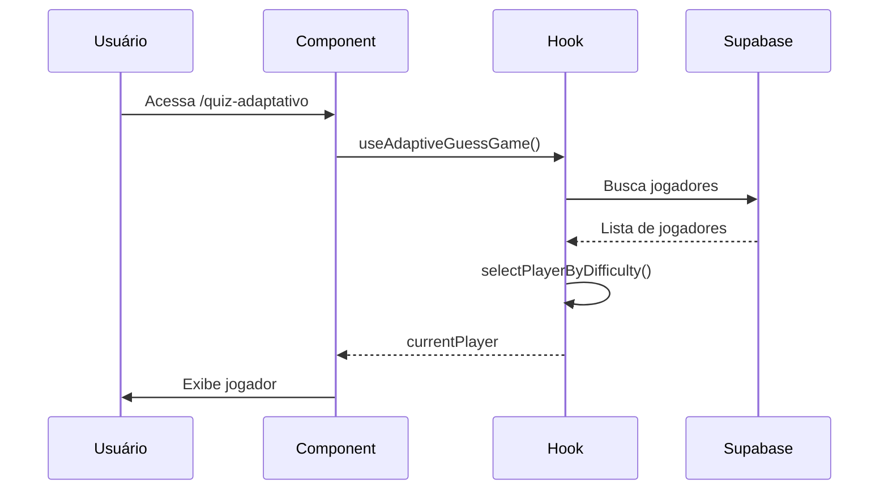
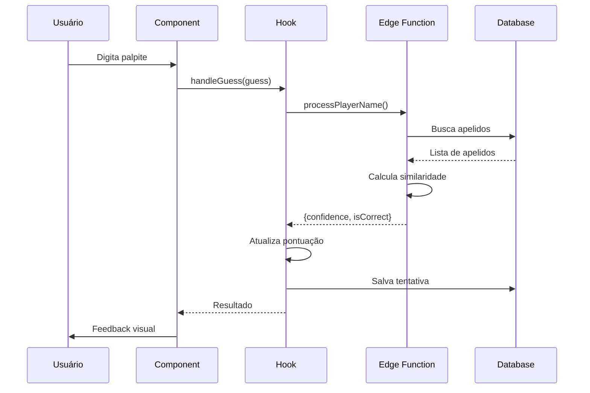
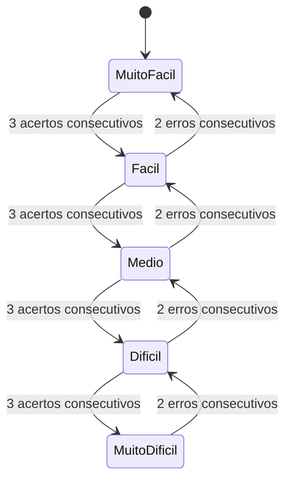

# 🏗️ Arquitetura do Lendas do Flu

## Visão Geral

O "Lendas do Flu" é uma aplicação web de quiz sobre jogadores históricos do Fluminense Football Club. A arquitetura foi projetada para ser escalável, manutenível e otimizada para performance.

## Diagrama de Arquitetura

```mermaid
graph TB
    subgraph "Frontend - React + TypeScript"
        A[App.tsx] --> B[Router]
        B --> C[Game Modes]
        B --> D[Admin]
        B --> E[News]
        C --> F[Adaptive Quiz]
        C --> G[Decade Quiz]
    end
    
    subgraph "State Management"
        H[Zustand Stores]
        I[React Query Cache]
        J[Local Storage]
    end
    
    subgraph "Backend - Supabase"
        K[PostgreSQL]
        L[Edge Functions]
        M[Storage]
        N[Auth]
    end
    
    F --> H
    G --> H
    F --> I
    G --> I
    I --> K
    L --> K
    D --> N
    
    style A fill:#1a472a
    style K fill:#2d5f3f
    style F fill:#8b0000
    style G fill:#8b0000
```



## Estrutura de Pastas

```
src/
├── core/                    # Lógica de negócio central
│   ├── game/               # Sistema de jogo
│   ├── player/             # Gestão de jogadores
│   └── scoring/            # Sistema de pontuação
├── features/               # Funcionalidades por domínio
│   ├── game-adaptive/     # Quiz adaptativo
│   ├── game-decade/       # Quiz por década
│   ├── admin/             # Painel administrativo
│   ├── news/              # Portal de notícias
│   └── achievements/      # Sistema de conquistas
├── components/            # Componentes React
│   ├── ui/               # Componentes base (shadcn)
│   ├── guess-game/       # Componentes do quiz
│   ├── admin/            # Componentes admin
│   └── ...
├── hooks/                # Hooks customizados
├── utils/                # Utilitários
├── services/             # Serviços de API
├── stores/               # Zustand stores
└── types/                # Definições TypeScript
```

## Fluxo de Dados

### 1. Inicialização do Jogo



### 2. Processamento de Palpite



### 3. Sistema de Dificuldade Adaptativa



## Componentes Principais

### 1. Game Containers

**AdaptiveGameContainer** - Container principal do quiz adaptativo
- Gerencia autenticação de convidados
- Controla início do timer
- Integra sistema de conquistas
- Renderiza componentes do jogo

**DecadeGameContainer** - Container do quiz por década
- Filtra jogadores por década
- Mesmo sistema adaptativo
- Timer e pontuação independentes

### 2. Hooks Customizados

**useAdaptiveGuessGame** - Hook principal do jogo adaptativo
- Seleção de jogadores por dificuldade
- Ajuste automático de dificuldade
- Gestão de timer e pontuação
- Processamento de palpites

**useAdaptivePlayerSelection** - Seleção inteligente de jogadores
- Filtra por nível de dificuldade
- Evita repetição de jogadores
- Fallback para jogadores disponíveis

**useSimpleGameMetrics** - Métricas e analytics
- Rastreamento de tentativas
- Cálculo de duração
- Salvamento de histórico

### 3. Services

**playerDataService** - Gestão de dados de jogadores
- CRUD de jogadores
- Upload de imagens
- Validação de dados

**gameHistoryService** - Histórico de partidas
- Salvamento de sessões
- Cálculo de estatísticas
- Ranking de jogadores

**achievementsService** - Sistema de conquistas
- Verificação de condições
- Desbloqueio de achievements
- Progresso do usuário

## Stack Tecnológica

### Frontend
- **React 18**: Biblioteca UI com Concurrent Features
- **TypeScript**: Type safety e IntelliSense
- **Vite**: Build tool rápido
- **Tailwind CSS**: Utility-first CSS
- **shadcn/ui**: Componentes acessíveis

### Backend
- **Supabase**: Backend-as-a-Service
  - PostgreSQL: Banco de dados relacional
  - Edge Functions: Serverless compute
  - Storage: Upload de imagens
  - Auth: Autenticação de usuários
  - Realtime: Subscriptions em tempo real

### State Management
- **Zustand**: State management leve
- **React Query**: Cache e sincronização de dados
- **LocalStorage**: Persistência local

### Performance
- **React.lazy**: Code splitting
- **React.memo**: Memoização de componentes
- **useMemo/useCallback**: Otimização de renders
- **Service Worker**: Cache offline

### Analytics & Monitoring
- **Sentry**: Error tracking
- **Google Analytics**: Usage analytics
- **Web Vitals**: Performance metrics

## Patterns e Práticas

### 1. Component Pattern
- Container/Presentational separation
- Compound components para complexidade
- Render props quando necessário
- Custom hooks para lógica compartilhada

### 2. State Management
- Zustand para estado global simples
- React Query para estado servidor
- Local state para UI temporária
- Context para temas e providers

### 3. Error Handling
- Error Boundaries em níveis críticos
- Try/catch em operações assíncronas
- Logging estruturado para debug
- Fallbacks graceful para usuário

### 4. Performance
- Lazy loading de rotas
- Memoização seletiva
- Virtualização de listas longas
- Debounce em inputs
- Image optimization

## Segurança

### 1. Autenticação
- JWT tokens via Supabase Auth
- Row Level Security (RLS) no banco
- Session management seguro

### 2. Validação
- Zod schemas para runtime validation
- TypeScript para compile-time safety
- Sanitização de inputs do usuário

### 3. Edge Functions
- Rate limiting
- Input validation
- Error handling robusto

## Escalabilidade

### 1. Database
- Índices otimizados
- Query optimization
- Connection pooling
- Read replicas (futuro)

### 2. Frontend
- Code splitting agressivo
- Asset optimization
- CDN para static assets
- Service Worker caching

### 3. Backend
- Edge Functions escaláveis
- Supabase auto-scaling
- Cache strategies

## Deployment

### Pipeline
1. **Development**: Local com Vite dev server
2. **Preview**: Lovable preview deployments
3. **Production**: Lovable.app hosting

### Environments
- `.env.local`: Variáveis locais
- Supabase project: Dev/Prod separation
- Edge Functions: Versioned deployments

## Monitoramento

### Métricas Chave
- **Core Web Vitals**: LCP, FID, CLS
- **Game Metrics**: Taxa de acerto, tempo médio
- **User Metrics**: DAU, MAU, retention
- **Error Rate**: Errors por sessão

### Alertas
- Error spikes (Sentry)
- Performance degradation
- API failures
- Database slow queries

## Roadmap Técnico

### Curto Prazo (1-2 meses)
- [ ] Implementar testes unitários (Vitest)
- [ ] Adicionar E2E tests (Playwright)
- [ ] Melhorar acessibilidade (WCAG 2.1)
- [ ] Otimizar bundle size

### Médio Prazo (3-6 meses)
- [ ] Migrar para React Server Components
- [ ] Implementar cache distribuído
- [ ] Add WebSocket para real-time
- [ ] Multi-language support

### Longo Prazo (6-12 meses)
- [ ] Mobile app (React Native)
- [ ] Modo multiplayer
- [ ] AI-powered difficulty
- [ ] Advanced analytics dashboard
