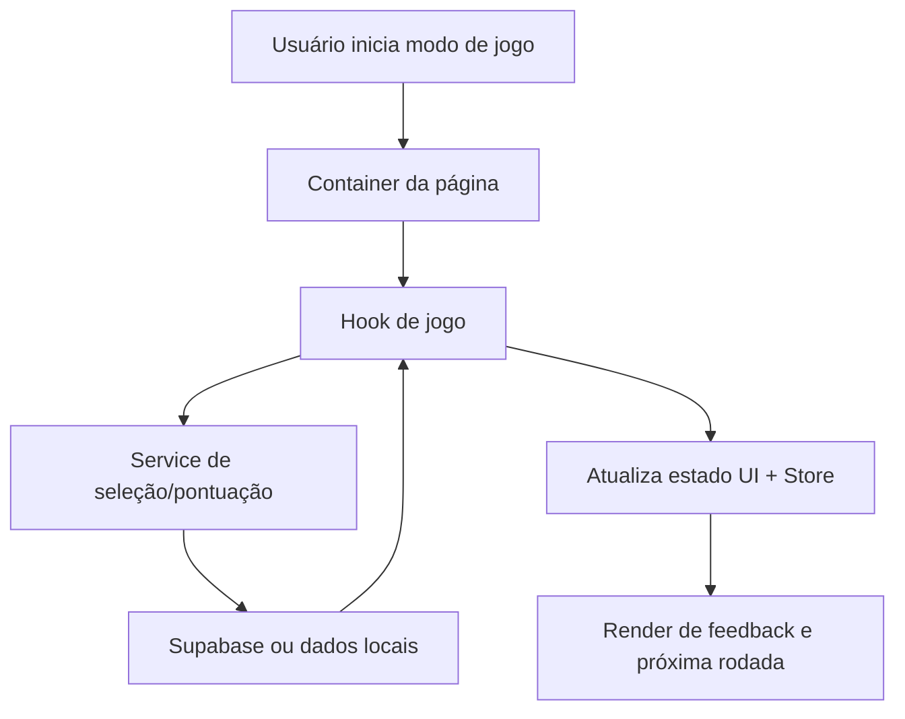

# Arquitetura da Aplicação

## 1. Visão em camadas

A aplicação segue uma arquitetura em camadas para separar responsabilidades:

1. **Apresentação** (`components`, `pages`)
2. **Orquestração de fluxo** (`hooks`)
3. **Domínio e serviços** (`services`, `utils`)
4. **Estado e contratos** (`stores`, `schemas`, `types`)
5. **Infra e integrações** (`integrations/supabase`, storage, edge functions)

Essa separação é essencial para diagnosticar erros de forma rápida: cada camada tem sintomas típicos e pontos de coleta de evidência.

## 2. Fluxo principal do jogo

## 3. Componentes arquiteturais críticos

### 3.1 Modo de jogo

- Hooks de jogo concentram regras de progressão (tentativas, dificuldade, rodada).
- Serviços encapsulam regras de seleção e persistência.
- UI deve apenas refletir estado e emitir eventos (não duplicar regra de negócio).

### 3.2 Tratamento de erro

- Error boundaries protegem renderização de blocos críticos.
- Serviços devem retornar falhas tratáveis (mensagem + contexto mínimo).
- Logs precisam incluir rota, modo de jogo e payload resumido.

### 3.3 Dados e validação

- Schemas garantem contrato entre frontend e backend.
- Tipos (`types`) definem fronteira de dados confiáveis.
- Dados externos nunca devem entrar no fluxo principal sem validação.

## 4. Estratégia de escalabilidade

- **Horizontal (features):** novas modalidades entram por novos containers/hooks sem quebrar existentes.
- **Vertical (confiabilidade):** erros recorrentes viram testes e runbook.
- **Operacional:** observabilidade e triagem padronizada reduzem MTTR.

## 5. Decisões de design (resumo)

1. **React + hooks** para composição de lógica por fluxo.
2. **Zustand** para estado global simples e previsível.
3. **TanStack Query** para cache e sincronização de dados remotos.
4. **Supabase** para backend com autenticação e storage integrado.

## 6. Limites de responsabilidade

- `components/`: renderizar e coletar interação.
- `hooks/`: coordenar estado e casos de uso.
- `services/`: regras puras e acesso a dados.
- `integrations/`: detalhes de SDK/infra externa.

Se um bug exige mexer em múltiplas camadas, a correção deve explicar claramente por que cada camada foi alterada.

## 7. Arquitetura para evolução com IA

Para manter qualidade em mudanças assistidas por IA:

- usar hipóteses testáveis,
- restringir escopo por camada,
- exigir evidência de validação,
- documentar trade-offs e rollback.

Referências operacionais:

- `docs/AI_GUIDE.md`
- `docs/ERROR_TRIAGE.md`
- `docs/CONTRIBUTING.md`

## 8. Leitura rápida para agentes de IA

Para reduzir tempo de diagnóstico em tarefas amplas, consulte primeiro `docs/AI_CODEBASE_INDEX.md` e depois aprofunde por camada neste documento.
