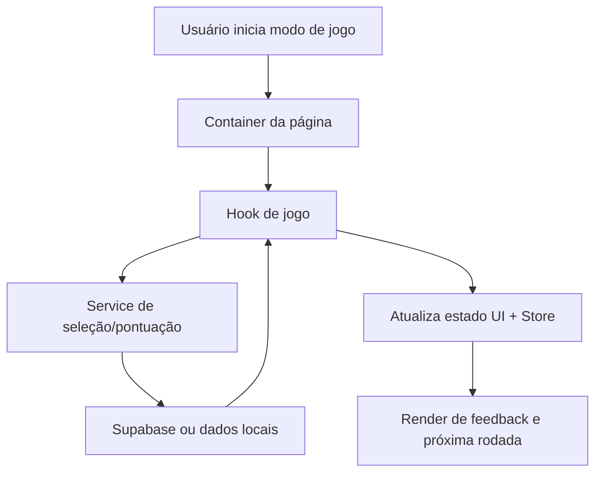

# Arquitetura da Aplicação

## 1. Visão em camadas

A aplicação segue uma arquitetura em camadas para separar responsabilidades:

1. **Apresentação** (`components`, `pages`)
2. **Orquestração de fluxo** (`hooks`)
3. **Domínio e serviços** (`services`, `utils`)
4. **Estado e contratos** (`stores`, `schemas`, `types`)
5. **Infra e integrações** (`integrations/supabase`, storage, edge functions)

Essa separação é essencial para diagnosticar erros de forma rápida: cada camada tem sintomas típicos e pontos de coleta de evidência.

## 2. Fluxo principal do jogo

```mermaid
flowchart TD
    A[Usuário inicia modo de jogo] --> B[Container da página]
    B --> C[Hook de jogo]
    C --> D[Service de seleção/pontuação]
    D --> E[Supabase ou dados locais]
    E --> C
    C --> F[Atualiza estado UI + Store]
    F --> G[Render de feedback e próxima rodada]
```

## 3. Componentes arquiteturais críticos

### 3.1 Modo de jogo

- Hooks de jogo concentram regras de progressão (tentativas, dificuldade, rodada).
- Serviços encapsulam regras de seleção e persistência.
- UI deve apenas refletir estado e emitir eventos (não duplicar regra de negócio).

### 3.2 Tratamento de erro

- Error boundaries protegem renderização de blocos críticos.
- Serviços devem retornar falhas tratáveis (mensagem + contexto mínimo).
- Logs precisam incluir rota, modo de jogo e payload resumido.

### 3.3 Dados e validação

- Schemas garantem contrato entre frontend e backend.
- Tipos (`types`) definem fronteira de dados confiáveis.
- Dados externos nunca devem entrar no fluxo principal sem validação.

## 4. Estratégia de escalabilidade

- **Horizontal (features):** novas modalidades entram por novos containers/hooks sem quebrar existentes.
- **Vertical (confiabilidade):** erros recorrentes viram testes e runbook.
- **Operacional:** observabilidade e triagem padronizada reduzem MTTR.

## 5. Decisões de design (resumo)

1. **React + hooks** para composição de lógica por fluxo.
2. **Zustand** para estado global simples e previsível.
3. **TanStack Query** para cache e sincronização de dados remotos.
4. **Supabase** para backend com autenticação e storage integrado.

## 6. Limites de responsabilidade

- `components/`: renderizar e coletar interação.
- `hooks/`: coordenar estado e casos de uso.
- `services/`: regras puras e acesso a dados.
- `integrations/`: detalhes de SDK/infra externa.

Se um bug exige mexer em múltiplas camadas, a correção deve explicar claramente por que cada camada foi alterada.

## 7. Arquitetura para evolução com IA

Para manter qualidade em mudanças assistidas por IA:

- usar hipóteses testáveis,
- restringir escopo por camada,
- exigir evidência de validação,
- documentar trade-offs e rollback.

Referências operacionais:

- `docs/AI_GUIDE.md`
- `docs/ERROR_TRIAGE.md`
- `docs/CONTRIBUTING.md`

## 8. Leitura rápida para agentes de IA

Para reduzir tempo de diagnóstico em tarefas amplas, consulte primeiro `docs/AI_CODEBASE_INDEX.md` e depois aprofunde por camada neste documento.

## Estado atual de autenticação e retenção (02/10/2026)

- `src/App.tsx` permite convidado apenas nas quatro rotas de seleção/quiz via `ProtectedRoute allowGuest`. `guest-demo-completed` em sessionStorage encerra a demo por sessão; não concede privilégios de backend.
- `Auth.tsx` escolhe web ou nativo. `useAuth.tsx` resolve a sessão e o evento pendente do funil. `auth-funnel.ts` envia enums GA4, valida provedor/validade do storage e não armazena dados pessoais. One Tap e o funil legado permanecem separados.
- `use-game-orchestration.ts` integra resposta, fim de partida, desafios e sequência de dias. `use-daily-challenges-module.ts` aceita alias `max_streak` para os templates `streak` e serializa writes por usuário/desafio na mesma sessão. Isso não é uma transação entre dispositivos.
- `use-play-streak.ts` só lê ao montar; grava após partida concluída. Calendário: America/Sao_Paulo.
- `rotate-daily-challenges` encerra conjuntos antigos em vez de estender suas datas. Código no repo não comprova deploy. Criação/recompensa idempotente e transacional entre processos exige trabalho server-side separado.
- Sem ledger de recompensa, conclusão é progresso, não bônus competitivo. Não anunciar pontos creditados sem crédito real.
- `index.html` carrega GA4 e o cliente gerado Supabase tem configuração fixa. Variáveis Vite existentes não devem ser tratadas como substituição automática dessa infraestrutura.
