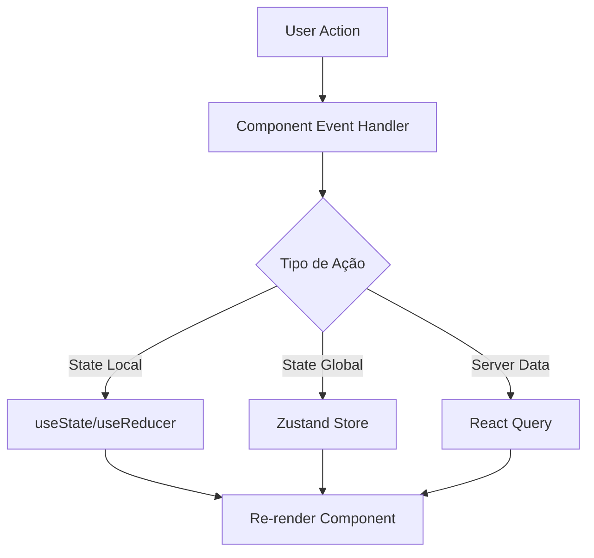

# 🗺️ Mapa de Componentes - Lendas do Flu

Este documento mapeia a hierarquia e responsabilidades de todos os componentes do projeto.

---

## 📊 Hierarquia Visual

```
App.tsx
├── RootLayout
│   ├── TopNavigation
│   ├── PWAInstallPrompt
│   └── Routes
│       ├── Index (Homepage)
│       │   ├── GameModesPreview (3 ModeCards)
│       │   ├── GameTypeRankings (Podium + lista)
│       │   └── HOW_IT_WORKS section
│       ├── ProtectedRoute (guard — redireciona para /auth se não autenticado)
│       │   ├── GameModeSelection (3 cards 16:9 + stats bars + activity bar)
│       │   ├── AdaptiveGuessPlayerSimple
│       │   │   └── AdaptiveGameContainer
│       │   │       ├── GameHeader (score + streak 2-cards)
│       │   │       ├── AdaptiveTutorial
│       │   │       ├── AdaptivePlayerImage (+ feedbackState prop)
│       │   │       ├── QuizFeedbackZone (idle/correct/wrong inline) ← NOVO
│       │   │       ├── ProgressDots (10 dots) ← NOVO
│       │   │       ├── GuessForm (sem confirm dialog)
│       │   │       ├── AdaptiveDifficultyIndicator (+ variant="horizontal-4")
│       │   │       ├── GameTimer (64px, urgent ≥15s)
│       │   │       └── GameOverDialog
│       │   ├── DecadeGuessPlayerSimple
│       │   │   └── DecadeGameContainer
│       │   └── JerseyQuizPage
│       │       └── JerseyGameContainer
│       │           ├── JerseyHudBar (score/timer/counter HUD) ← NOVO
│       │           ├── JerseyImage (+ feedbackState prop)
│       │           ├── JerseyYearOptions (two-step pendingYear confirm)
│       │           ├── JerseyEducationalReveal (fun_fact reveal) ← NOVO
│       │           └── JerseyTutorial
│       ├── Admin (AdminRouteGuard)
│       │   └── AdminDashboard
│       └── NewsPortal
│           └── NewsGrid
```

---

## 🎮 Componentes de Jogo

### **AdaptiveGameContainer**
**Localização**: `src/components/guess-game/AdaptiveGameContainer.tsx`

**Responsabilidade**: Container principal do modo de jogo adaptativo

**Props**:
```typescript
interface AdaptiveGameContainerProps {
  players: Player[];
  onGameEnd?: (score: number) => void;
}
```

**Estado Gerenciado**:
- Jogo completo (via `useAdaptiveGuessGame`)
- UI (via `useUIGameState`)
- Analytics (via `useEnhancedAnalytics`)

**Subcomponentes**:
- `AdaptiveTutorial` - Tutorial inicial
- `GuestNameForm` - Formulário de nome para visitantes
- `AdaptivePlayerImage` - Imagem do jogador com loading
- `GuessForm` - Formulário de tentativa
- `AdaptiveGameStatus` - Status do jogo (score, vidas)
- `GameTimer` - Timer do jogo
- `GameOverDialog` - Dialog de fim de jogo

---

### **DecadeGameContainer**
**Localização**: `src/components/decade-game/DecadeGameContainer.tsx`

**Responsabilidade**: Container para modo de jogo por década

**Props**:
```typescript
interface DecadeGameContainerProps {
  selectedDecade: Decade;
}
```

**Diferenças do AdaptiveGameContainer**:
- Usa `useDecadeGameState` ao invés de `useAdaptiveGuessGame`
- Filtra jogadores por década selecionada
- Não tem sistema de dificuldade adaptativa

---

### **BaseGameContainer**
**Localização**: `src/components/guess-game/BaseGameContainer.tsx`

**Responsabilidade**: Base compartilhada para containers de jogo

**Props**:
```typescript
interface BaseGameContainerProps {
  children: React.ReactNode;
  onGameEnd?: () => void;
}
```

**Uso**: Wrapper reutilizável para diferentes modos de jogo

---

## 🧩 Componentes de UI Base (shadcn)

### **Button**
```typescript
<Button variant="default | destructive | outline | secondary | ghost | link">
  Texto
</Button>
```

### **Card**
```typescript
<Card>
  <CardHeader>
    <CardTitle>Título</CardTitle>
    <CardDescription>Descrição</CardDescription>
  </CardHeader>
  <CardContent>Conteúdo</CardContent>
  <CardFooter>Rodapé</CardFooter>
</Card>
```

### **Dialog**
```typescript
<Dialog open={open} onOpenChange={setOpen}>
  <DialogTrigger>Botão</DialogTrigger>
  <DialogContent>
    <DialogHeader>
      <DialogTitle>Título</DialogTitle>
      <DialogDescription>Descrição</DialogDescription>
    </DialogHeader>
    Conteúdo
  </DialogContent>
</Dialog>
```

### **Input**
```typescript
<Input 
  type="text" 
  placeholder="Digite..." 
  value={value}
  onChange={(e) => setValue(e.target.value)}
/>
```

**Localização**: `src/components/ui/`

---

## 🎯 Componentes de Game UI

### **GameHeader**
**Responsabilidade**: Cabeçalho do jogo com informações básicas

**Exibe**:
- Logo/título
- Botões de ação (menu, ajuda)
- Indicador de modo de jogo

---

### **GameStatus / AdaptiveGameStatus**
**Responsabilidade**: Status atual do jogo

**Exibe**:
- Score atual
- Vidas restantes
- Streak atual
- Dificuldade (no modo adaptativo)

**Props**:
```typescript
interface GameStatusProps {
  score: number;
  lives: number;
  streak: number;
  difficulty?: DifficultyLevel;
}
```

---

### **GameTimer**
**Responsabilidade**: Timer contagem regressiva

**Props**:
```typescript
interface GameTimerProps {
  timeRemaining: number;
  totalTime: number;
  isRunning: boolean;
  onTimeUp: () => void;
}
```

**Comportamento**:
- Conta regressivamente
- Muda cor quando tempo < 10s
- Chama `onTimeUp` quando chega a 0

---

### **PlayerImage / AdaptivePlayerImage**
**Responsabilidade**: Exibir imagem do jogador com lazy loading

**Props**:
```typescript
interface PlayerImageProps {
  player: Player;
  onLoad?: () => void;
  onError?: () => void;
}
```

**Features**:
- Lazy loading com IntersectionObserver
- Placeholder durante carregamento
- Fallback em caso de erro
- Cache via Service Worker

---

### **GuessForm**
**Responsabilidade**: Formulário de tentativa

**Props**:
```typescript
interface GuessFormProps {
  onSubmit: (guess: string) => void;
  disabled?: boolean;
  placeholder?: string;
}
```

**Validação**:
- Mínimo 2 caracteres
- Remove espaços extras
- Previne submit duplicado

---

### **GameOverDialog**
**Responsabilidade**: Dialog exibido ao fim do jogo

**Props**:
```typescript
interface GameOverDialogProps {
  open: boolean;
  score: number;
  correctGuesses: number;
  totalAttempts: number;
  onPlayAgain: () => void;
  onViewRanking: () => void;
}
```

**Exibe**:
- Score final
- Estatísticas da partida
- Botões de ação (jogar novamente, ver ranking)

---

## 📋 Componentes de Formulário

### **GuestNameForm**
**Responsabilidade**: Captura nome de visitantes não autenticados

**Props**:
```typescript
interface GuestNameFormProps {
  onSubmit: (name: string) => void;
  onSkip?: () => void;
}
```

---

### **AddPlayerForm** (Admin)
**Responsabilidade**: Formulário de adição de jogador

**Campos**:
- Nome
- Posição
- URL da imagem
- Dificuldade
- Décadas
- Estatísticas
- Curiosidade

---

### **EditPlayerForm** (Admin)
**Responsabilidade**: Formulário de edição de jogador

**Similar ao AddPlayerForm** mas com dados pré-preenchidos

---

## 🏆 Componentes de Ranking

### **PlayerRanking**
**Responsabilidade**: Exibe ranking de jogadores

**Props**:
```typescript
interface PlayerRankingProps {
  limit?: number;
  gameMode?: string;
}
```

**Exibe**:
- Top N jogadores
- Nome, score, jogos
- Posição no ranking

---

## 🎓 Componentes de Tutorial

### **GameTutorial / AdaptiveTutorial**
**Responsabilidade**: Tutorial do jogo para novos jogadores

**Props**:
```typescript
interface TutorialProps {
  onComplete: () => void;
  onSkip?: () => void;
}
```

**Passos**:
1. Como jogar
2. Sistema de pontuação
3. Dicas

---

## 🎨 Componentes de Achievements

### **AchievementSystem**
**Responsabilidade**: Sistema completo de conquistas

**Subcomponentes**:
- `AchievementNotification` - Notificação de conquista
- `AchievementsGrid` - Grid de todas conquistas (para integração futura)
- `AchievementProgressCard` - Card de progresso

---

## 🛡️ Componentes de Error Boundary

### **RootErrorBoundary**
**Localização**: `src/components/error-boundaries/RootErrorBoundary.tsx`

**Responsabilidade**: Captura erros no nível da aplicação

---

### **GameErrorBoundary**
**Localização**: `src/components/error-boundaries/GameErrorBoundary.tsx`

**Responsabilidade**: Captura erros específicos do jogo

---

### **AdminErrorBoundary**
**Localização**: `src/components/error-boundaries/AdminErrorBoundary.tsx`

**Responsabilidade**: Captura erros no dashboard admin

---

## 🔐 Componentes de Auth

### **AuthButton**
**Responsabilidade**: Botão de login/logout

**Estados**:
- Não autenticado: Mostra "Entrar"
- Autenticado: Mostra nome do usuário + dropdown

---

### **GameAuthSelection**
**Responsabilidade**: Seleção de jogar como visitante ou autenticado

**Usado em**: GuestNameForm

---

## 📰 Componentes de News

### **NewsGrid**
**Responsabilidade**: Grid de notícias

**Props**:
```typescript
interface NewsGridProps {
  articles: NewsArticle[];
  isLoading?: boolean;
}
```

---

### **NewsCard**
**Responsabilidade**: Card individual de notícia

**Exibe**:
- Imagem destacada
- Título
- Resumo
- Data de publicação
- Categoria

---

## 🎯 Componentes Admin

### **AdminDashboard**
**Responsabilidade**: Dashboard principal do admin

**Abas**:
- Overview - Estatísticas gerais
- Players - Gerenciamento de jogadores
- Users - Gerenciamento de usuários
- Reports - Relatórios

---

### **PlayersManagement**
**Responsabilidade**: CRUD de jogadores

**Ações**:
- Listar jogadores
- Adicionar jogador
- Editar jogador
- Remover jogador

---

## ⚡ Componentes de Performance

### **LazyLoad**
**Responsabilidade**: Wrapper para lazy loading de componentes

**Uso**:
```typescript
<LazyLoad>
  <HeavyComponent />
</LazyLoad>
```

---

## 🎨 Componentes Customizados

### **UnifiedPlayerImage**
**Responsabilidade**: Componente unificado de imagem de jogador

**Features**:
- Otimização automática
- Lazy loading
- Fallback
- Cache

---

### **UnifiedSkeleton**
**Responsabilidade**: Skeleton loader unificado

**Variantes**:
- Card
- List
- Text
- Avatar

---

## 📱 Componentes Mobile

### **MobileGameNavigation**
**Responsabilidade**: Navegação otimizada para mobile

---

### **TouchOptimizedButton**
**Responsabilidade**: Botão com área de toque otimizada (48x48px mínimo)

---

### **SwipeGestureWrapper**
**Responsabilidade**: Wrapper para gestos de swipe

---

## 🌐 Componentes PWA

### **PWAInstallPrompt**
**Responsabilidade**: Prompt de instalação do PWA

**Exibe**:
- Banner de instalação
- Instruções por plataforma

---

### **PWAStatusIndicator**
**Responsabilidade**: Indicador de status offline/online

---

## 📊 Fluxo de Dados



---

## 🎯 Convenções de Nomenclatura

### **Componentes**
- PascalCase: `PlayerCard`, `GameContainer`
- Suffixos descritivos: `...Form`, `...Dialog`, `...Card`

### **Props**
- camelCase: `onSubmit`, `isLoading`, `playerData`
- Prefixos booleanos: `is...`, `has...`, `should...`
- Prefixos de callback: `on...`, `handle...`

### **Eventos**
- Formato: `on[Action]`: `onClick`, `onSubmit`, `onGameEnd`

---

## 📁 Estrutura de Pastas

```
src/components/
├── ui/                 # Componentes base (shadcn)
├── guess-game/        # Componentes do jogo principal
├── decade-game/       # Componentes do modo década
├── admin/             # Componentes administrativos
├── auth/              # Componentes de autenticação
├── achievements/      # Sistema de conquistas
├── error-boundaries/  # Error boundaries
├── performance/       # Componentes de performance
├── mobile/            # Componentes mobile-specific
├── news/              # Componentes de notícias
├── pwa/               # Componentes PWA
└── social/            # Componentes de compartilhamento
```

---

## 🎮 Componentes do Quiz Adaptativo (novos/atualizados)

### **QuizFeedbackZone**
**Localização**: `src/components/guess-game/QuizFeedbackZone.tsx`

Feedback inline após tentativa — substitui toasts. Auto-reset para `idle` via `onIdle` callback após 2s.

**Props**:
```typescript
interface QuizFeedbackZoneProps {
  state: 'idle' | 'correct' | 'wrong';
  playerName?: string;
  points?: number;
  onIdle: () => void;
}
```

### **ProgressDots**
**Localização**: `src/components/guess-game/ProgressDots.tsx`

10 pontos de progresso: verde=correto, vermelho=errado, cinza=restante.

**Props**:
```typescript
interface ProgressDotsProps {
  total?: number;  // default 10
  correct: number;
  wrong: number;
}
```

### **GameTimer** (atualizado)
SVG 64×64px, r=28, circumference≈175.9. Urgent em ≤15s (era 10s), critical em ≤5s.

### **AdaptivePlayerImage** (atualizado)
Aceita `feedbackState: 'idle' | 'correct' | 'wrong'`. Aplica borda/glow/shake conforme estado.

---

## 👕 Componentes do Quiz das Camisas

### **JerseyGameContainer** (atualizado)
Layout 2 colunas (`1fr / 1.3fr`). `feedbackState` derivado de `showResult + selectedOption`. `pendingYear` resetado via `useEffect` ao mudar de rodada.

### **JerseyHudBar**
**Localização**: `src/components/jersey-game/JerseyHudBar.tsx`

HUD horizontal com: score, timer SVG 56px (r=24, urgent <15s), contador "Camisa X/Y", badge "Modo Camisas".

### **JerseyImage** (atualizado)
Aceita `feedbackState: 'idle' | 'correct' | 'wrong'`. Borda dourada idle, glow verde correto, vermelho errado.

### **JerseyYearOptions** (atualizado)
Two-step confirm: click na opção seta `pendingYear` → botão "Confirmar" chama o hook. `aria-pressed` e `aria-label` adicionados.

### **JerseyEducationalReveal**
**Localização**: `src/components/jersey-game/JerseyEducationalReveal.tsx`

Card pós-resposta com `fun_fact`, pontos ganhos (correto) ou ano correto (errado). Gradiente gold/grená.

### **JerseyTutorial**
Tutorial de onboarding para novos jogadores do quiz de camisas (4 passos).

---

## 🏠 Componentes da Home

### **GameModesPreview** (atualizado)
Três `ModeCard` com `accentStyles` lookup (grena/verde/gold). Recebe `playerCount` e `jerseyCount` como props do `Index.tsx` — não faz queries próprias.

**Props**:
```typescript
interface GameModesPreviewProps {
  playerCount: number;
  jerseyCount: number;
}
```

### **GameTypeRankings** (atualizado)
Componente `Podium` para top 3 (silver | gold elevado | bronze). Helper `useRankingQuery` para as 3 queries. Tabs: Adaptativo / Clássico / Camisas.

## 📊 Componentes Admin Compartilhados

### **PeriodSelector**
Seletor de período para relatórios (7, 14, 30, 60, 90 dias).

---

## 🔐 Guards de Rota

### **ProtectedRoute**
**Localização**: `src/components/guards/ProtectedRoute.tsx`

Redireciona para `/auth` com `state.from = location` se o usuário não estiver autenticado.
Usado em: `/selecionar-modo-jogo`, `/quiz-adaptativo`, `/quiz-decada`, `/quiz-camisas`.

```typescript
interface ProtectedRouteProps {
  children: ReactNode;
}
```

---

**Última atualização**: 2026-05-16
