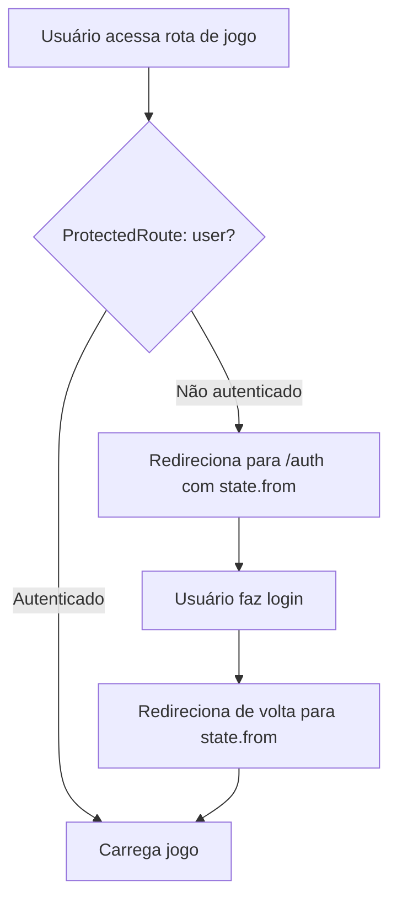
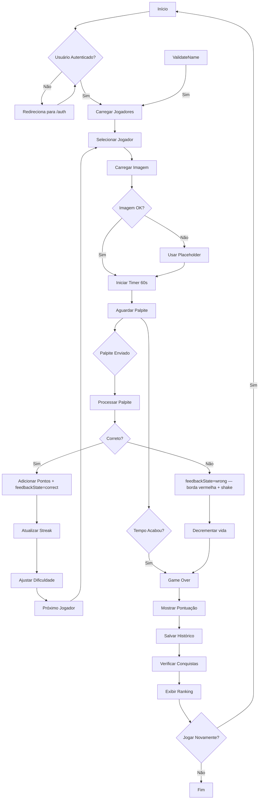
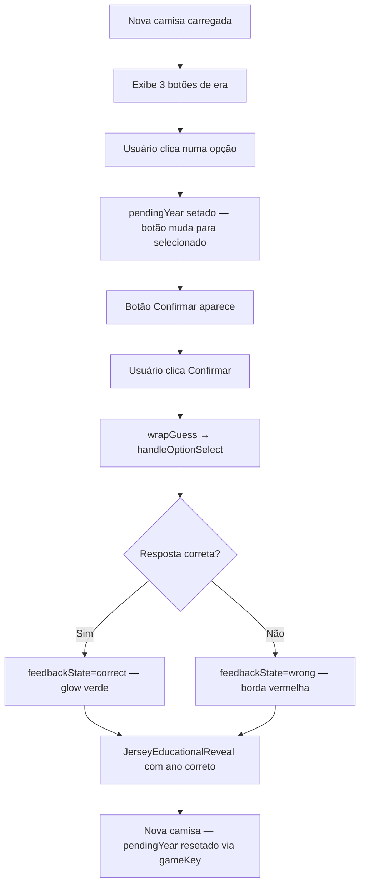

# 🎮 Fluxo do Jogo - Lendas do Flu

## Visão Geral

Este documento detalha o fluxo completo de uma partida no "Lendas do Flu", incluindo todos os modos de jogo.

## Modos de Jogo

### 1. Quiz Adaptativo (`/quiz-adaptativo`)
Sistema que ajusta a dificuldade automaticamente baseado no desempenho do jogador. Requer autenticação — `ProtectedRoute` redireciona para `/auth` se não logado.

### 2. Quiz por Década (`/quiz-decada`)
Jogadores filtrados por período histórico (1960s–2010s+). Requer autenticação.

### 3. Quiz das Camisas (`/quiz-camisas`)
Adivinhe o ano das camisas históricas do Fluminense escolhendo entre 3 opções via two-step confirm. Requer autenticação.

---

## Fluxo de Autenticação (pré-jogo)



**Nota**: O fluxo de "Jogar como convidado" foi removido. Todos os modos de jogo exigem conta.

---

## Fluxo Completo do Jogo (Quiz Adaptativo)



---

## Fase 1: Autenticação e Preparação

### 1.1 Verificação de Autenticação
```typescript
// Em AdaptiveGameContainer.tsx
const { user } = useAuth();

// Se não autenticado, mostrar formulário
if (!user && showGuestNameForm) {
  return <GuestNameForm onSubmit={handleGuestNameSubmitted} />;
}
```

**Estados:**
- `showTutorial`: Tutorial inicial (primeira vez)
- `showGuestNameForm`: Formulário para convidados
- `gameStarted`: Jogo iniciado (libera timer)

**Fluxo:**
1. Usuário acessa `/quiz-adaptativo`
2. Sistema verifica `useAuth()`
3. Se autenticado → vai direto para carregamento
4. Se convidado → exibe `GuestNameForm`

### 1.2 Formulário de Nome (Convidados)
```typescript
// GuestNameForm.tsx
const handleSubmit = (name: string) => {
  if (name.trim().length < 2) {
    toast.error("Nome muito curto");
    return;
  }
  
  onSubmit(name);
  registerGameStart(); // Registra no analytics
};
```

**Validações:**
- Nome mínimo: 2 caracteres
- Nome máximo: 50 caracteres
- Trim de espaços extras

---

## Fase 2: Carregamento de Jogadores

### 2.1 Busca de Jogadores

**Quiz Adaptativo:**
```typescript
// useAdaptiveGuessGame.ts
const { data: players } = useQuery({
  queryKey: ['players'],
  queryFn: async () => {
    const { data, error } = await supabase
      .from('players')
      .select('*')
      .order('name');
    
    return data || [];
  }
});
```

**Quiz por Década:**
```typescript
// useDecadePlayerSelection.ts
const loadDecadePlayers = async () => {
  const players = await decadePlayerService
    .getPlayersByDecade(selectedDecade);
  
  setAvailablePlayers(players);
};
```

### 2.2 Seleção do Primeiro Jogador

```typescript
// useAdaptivePlayerSelection.ts
const selectPlayerByDifficulty = useCallback((
  players: Player[],
  difficultyLevel: DifficultyLevel,
  usedPlayerIds: Set<string>
) => {
  // 1. Filtrar jogadores não usados
  const availablePlayers = players.filter(
    p => !usedPlayerIds.has(p.id)
  );
  
  // 2. Filtrar por dificuldade
  const matchingPlayers = availablePlayers.filter(
    p => p.difficulty_level === difficultyLevel
  );
  
  // 3. Selecionar aleatório
  const randomIndex = Math.floor(
    Math.random() * matchingPlayers.length
  );
  
  return matchingPlayers[randomIndex];
}, []);
```

**Critérios de Seleção:**
- Não repetir jogadores na mesma sessão
- Priorizar nível de dificuldade atual
- Fallback para qualquer dificuldade se necessário

---

## Fase 3: Carregamento de Imagem

### 3.1 Processo de Carregamento

```typescript
// UnifiedPlayerImage.tsx
<OptimizedImage
  src={imageUrl}
  alt={player.name}
  onLoad={handleImageLoad}
  onError={handleImageError}
  loading="eager"
  priority={true}
/>
```

**Estados da Imagem:**
1. `loading`: Carregando
2. `loaded`: Sucesso
3. `error`: Falha (usa placeholder)

### 3.2 Callback de Imagem Carregada

```typescript
// AdaptiveGameContainer.tsx
const handlePlayerImageLoaded = () => {
  console.log('🖼️ Imagem carregada, liberando início do timer');
  setImageLoaded(true);
  
  // Aguarda 100ms para garantir render
  setTimeout(() => {
    if (gameStarted && !gameOver) {
      startTimer();
    }
  }, 100);
};
```

**CRÍTICO:** Timer só inicia após imagem carregar!

---

## Fase 4: Jogo Ativo

### 4.1 Sistema de Timer

```typescript
// use-adaptive-guess-game.ts
const startTimer = () => {
  timerRef.current = setInterval(() => {
    setTimeLeft(prev => {
      if (prev <= 1) {
        handleTimeUp();
        return 0;
      }
      return prev - 1;
    });
  }, 1000);
};
```

**Configurações:**
- Duração: 60 segundos
- Atualização: 1 segundo
- Auto-stop em Game Over

### 4.2 Processamento de Palpite

```typescript
// use-simple-game-logic.ts
const handleGuess = async (guess: string) => {
  // 1. Validações
  if (!currentPlayer || !guess.trim()) return;
  
  // 2. Verificar resposta
  const isCorrect = isCorrectGuess(guess, currentPlayer.name);
  
  // 3. Se correto
  if (isCorrect) {
    const points = calculatePoints(difficulty, timeLeft);
    onCorrectGuess(points);
    
    // 4. Próximo jogador
    setTimeout(() => {
      selectRandomPlayer();
      startTimer(); // Reinicia timer
    }, 1500);
  }
  
  // 5. Se errado
  else {
    onIncorrectGuess(guess);
    onGameEnd();
  }
};
```

**Cálculo de Pontos:**
```typescript
const calculatePoints = (difficulty: number, timeLeft: number) => {
  const basePoints = 5;
  const difficultyMultiplier = DIFFICULTY_LEVELS[difficulty].multiplier;
  const timeBonus = timeLeft > 40 ? 2 : timeLeft > 20 ? 1 : 0;
  
  return Math.floor(
    basePoints * difficultyMultiplier + timeBonus
  );
};
```

### 4.3 Verificação de Nome

```typescript
// name-processor.ts
export const isCorrectGuess = (
  guess: string,
  targetName: string
): boolean => {
  const normalizedGuess = normalizeString(guess);
  const normalizedTarget = normalizeString(targetName);
  
  // 1. Match exato
  if (normalizedGuess === normalizedTarget) return true;
  
  // 2. Match parcial de palavras
  const guessWords = normalizedGuess.split(/\s+/);
  const targetWords = normalizedTarget.split(/\s+/);
  
  const matchingWords = guessWords.filter(gw =>
    targetWords.some(tw => tw.includes(gw) || gw.includes(tw))
  );
  
  // 3. Threshold: 50% das palavras
  return matchingWords.length >= Math.ceil(guessWords.length * 0.5);
};
```

**Considerações:**
- Ignora acentos e case
- Match parcial de nomes compostos
- Verifica apelidos do banco (via Edge Function)

---

## Fase 5: Sistema de Dificuldade Adaptativa

### 5.1 Ajuste de Dificuldade

```typescript
// use-decade-game-state.ts
const adjustDifficulty = (wasCorrect: boolean) => {
  if (wasCorrect) {
    const newCorrect = correctSequence + 1;
    
    // Sobe dificuldade após 3 acertos seguidos
    if (newCorrect >= 3 && currentDifficulty < 4) {
      setCurrentDifficulty(prev => prev + 1);
      setCorrectSequence(0);
      setIncorrectSequence(0);
    }
  } else {
    const newIncorrect = incorrectSequence + 1;
    
    // Desce dificuldade após 2 erros seguidos
    if (newIncorrect >= 2 && currentDifficulty > 0) {
      setCurrentDifficulty(prev => prev - 1);
      setCorrectSequence(0);
      setIncorrectSequence(0);
    }
  }
};
```

**Níveis de Dificuldade:**
| Nível | Label | Multiplier | Critério |
|-------|-------|------------|----------|
| 0 | Muito Fácil | 0.5x | Início |
| 1 | Fácil | 0.75x | 3 acertos |
| 2 | Médio | 1.0x | 3 acertos |
| 3 | Difícil | 1.5x | 3 acertos |
| 4 | Muito Difícil | 2.0x | 3 acertos |

### 5.2 Indicador Visual

```typescript
// AdaptiveDifficultyIndicator.tsx
<div className="flex items-center gap-2">
  <Badge variant={difficultyColor}>
    {DIFFICULTY_LEVELS[currentDifficulty].label}
  </Badge>
  
  <Progress 
    value={progressPercentage} 
    max={100}
  />
  
  <span className="text-sm">
    {correctSequence}/3 acertos
  </span>
</div>
```

---

## Fase 6: Game Over e Resultados

### 6.1 Condições de Game Over

1. **Palpite incorreto** → Fim imediato
2. **Timer zerou** → Fim imediato
3. **Usuário saiu da aba** → Fim (prevenção de trapaça)

### 6.2 Salvamento de Dados

```typescript
// use-simple-game-metrics.ts
const saveGameData = async (finalScore: number) => {
  await saveGameHistory({
    user_id: user.id,
    score: finalScore,
    correct_guesses: correctGuessesRef.current,
    total_attempts: totalAttemptsRef.current,
    game_duration: gameDuration
  });
};
```

**Dados Salvos:**
- `score`: Pontuação final
- `correct_guesses`: Acertos
- `total_attempts`: Total de tentativas
- `game_duration`: Duração em segundos
- `max_streak`: Maior sequência

### 6.3 Verificação de Conquistas

```typescript
// AchievementSystemProvider.tsx
const checkAchievements = async () => {
  // Verificar conquistas desbloqueadas
  const newAchievements = await achievementsService
    .checkAndUnlock(user.id, gameStats);
  
  // Exibir notificações
  newAchievements.forEach(achievement => {
    showAchievementNotification(achievement);
  });
};
```

**Exemplos de Conquistas:**
- "Primeira Vitória": 1º jogo completado
- "Sequência de 5": 5 acertos seguidos
- "Velocista": Acerto em < 10 segundos
- "Mestre dos 70s": 10 jogadores da década de 70

### 6.4 Exibição de Ranking

```typescript
// GameOverDialog.tsx
<DialogContent>
  <DialogHeader>
    <DialogTitle>Game Over!</DialogTitle>
    <DialogDescription>
      Pontuação final: {score}
    </DialogDescription>
  </DialogHeader>
  
  <div className="space-y-4">
    <div className="stats">
      <p>Acertos: {correctGuesses}</p>
      <p>Streak máximo: {maxStreak}</p>
    </div>
    
    <RankingDisplay topPlayers={topPlayers} />
    
    <Button onClick={handlePlayAgain}>
      Jogar Novamente
    </Button>
  </div>
</DialogContent>
```

---

## Casos Especiais

### 1. Perda de Conexão

```typescript
// Network detection
window.addEventListener('offline', () => {
  pauseGame();
  showToast('Conexão perdida', 'warning');
});

window.addEventListener('online', () => {
  resumeGame();
  showToast('Conexão restaurada', 'success');
});
```

### 2. Mudança de Aba

```typescript
// use-tab-visibility.ts
useEffect(() => {
  const handleVisibilityChange = () => {
    if (document.hidden && gameActive) {
      handleTabChange(); // Pausa ou finaliza
    }
  };
  
  document.addEventListener('visibilitychange', handleVisibilityChange);
}, [gameActive]);
```

### 3. Erro ao Carregar Jogador

```typescript
// Error boundary
if (error) {
  return (
    <ErrorDisplay
      message="Erro ao carregar jogadores"
      onRetry={refetch}
    />
  );
}
```

---

## Métricas e Analytics

### Eventos Rastreados

1. **game_start**: Início de partida
2. **game_end**: Fim de partida
3. **correct_guess**: Acerto
4. **incorrect_guess**: Erro
5. **difficulty_change**: Mudança de dificuldade
6. **achievement_unlocked**: Conquista desbloqueada

### Exemplo de Evento

```typescript
analytics.track('correct_guess', {
  player_name: currentPlayer.name,
  difficulty: currentDifficulty,
  time_taken: 60 - timeLeft,
  points_earned: points,
  current_streak: streak
});
```

---

## Otimizações de Performance

### 1. Preload de Imagens
```typescript
// Preload próximo jogador
const preloadNextPlayer = () => {
  const nextPlayer = selectNextPlayer();
  if (nextPlayer?.image_url) {
    const img = new Image();
    img.src = nextPlayer.image_url;
  }
};
```

### 2. Debounce de Input
```typescript
// Evitar processamento excessivo
const debouncedGuess = useMemo(
  () => debounce(handleGuess, 300),
  [handleGuess]
);
```

### 3. Memoização
```typescript
// Evitar re-renders desnecessários
const GameStatus = memo(({ score, streak, timeLeft }) => {
  // ...
});
```

---

## Fluxo do Quiz das Camisas (two-step confirm)



### Estado local no JerseyGameContainer

```typescript
const [pendingYear, setPendingYear] = useState<number | null>(null);

// Reset ao mudar de rodada
useEffect(() => {
  setPendingYear(null);
}, [gameKey]);

// feedbackState derivado (sem estado extra)
const feedbackState = showResult
  ? (selectedOption === jersey?.year ? 'correct' : 'wrong')
  : 'idle';
```

### Feedback inline (feedbackState)

Ambos os modos usam `feedbackState: 'idle' | 'correct' | 'wrong'` passado como prop para o componente de imagem/card.
**Não usar toast** para feedback de acerto/erro em jogo — ver ADR 011.

---

## Troubleshooting

### Problema: Timer inicia antes da imagem carregar
**Solução:** Verificar `imageLoaded` state e `handlePlayerImageLoaded` callback

### Problema: Jogador se repete
**Solução:** Verificar `usedPlayerIds` não está sendo resetado incorretamente

### Problema: Dificuldade não ajusta
**Solução:** Verificar `correctSequence` e `incorrectSequence` counters

### Problema: Pontuação não salva
**Solução:** Verificar autenticação e logs da `saveGameHistory`
