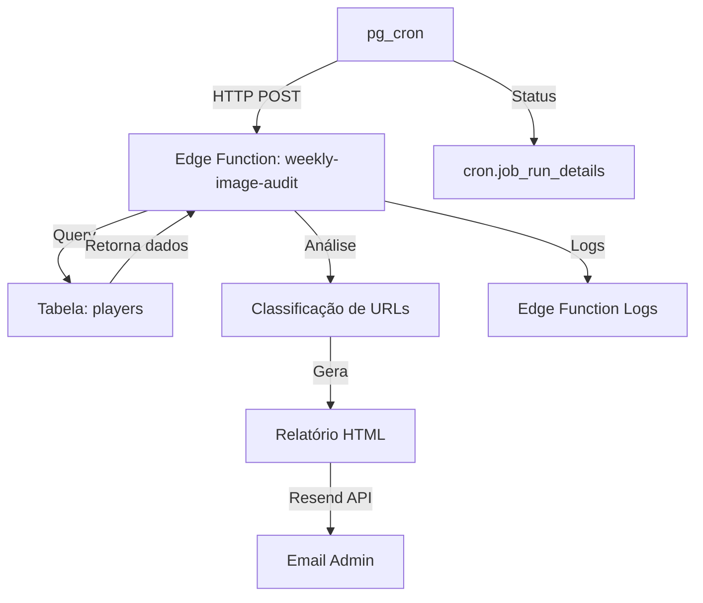

# ADR 007: Sistema Automatizado de Auditoria de Imagens

## Status
Aceito - 2025-12-01

## Contexto
Após implementação da estratégia de migração de imagens (ADR 006), identificamos a necessidade de monitoramento contínuo para:
- Detectar novas URLs externas problemáticas
- Notificar administradores proativamente
- Manter visibilidade sobre o estado das imagens
- Automatizar o processo de identificação de problemas

## Decisão
Implementamos um sistema de auditoria automatizada com 3 componentes principais:

### 1. Edge Function de Auditoria (`weekly-image-audit`)

**Localização:** `supabase/functions/weekly-image-audit/index.ts`

**Responsabilidades:**
- Query completa de todos os jogadores na tabela `players`
- Análise de cada URL de imagem:
  - Classificação: externa vs local
  - Validação de domínio
  - Detecção de domínios problemáticos
- Geração de estatísticas agregadas
- Composição de relatório HTML responsivo
- Envio de email via Resend

**Lógica de Classificação:**
```typescript
const isProblematic = 
  isExternal && 
  (isProblematicDomain(url) || isInvalidUrl(url))
```

### 2. Relatório HTML por Email

**Template Personalizado:**
- Header visual com gradiente (cores do Flu)
- Cards de estatísticas em grid 2x2:
  - Total de jogadores
  - URLs externas (azul)
  - URLs problemáticas (vermelho)
  - URLs locais (verde)
- Tabela responsiva de jogadores problemáticos:
  - Nome do jogador
  - URL completa (truncada com word-break)
  - Domínio identificado com badge
- Call-to-action com link direto para admin
- Footer com timestamp completo

**Destinatários:**
- Configurável no código da edge function
- Padrão: `admin@flulegendarium.com`
- Suporta múltiplos destinatários

### 3. Cron Job com pg_cron

**Configuração:**
```sql
SELECT cron.schedule(
  'weekly-image-audit',
  '0 9 * * 1',  -- Segunda-feira às 9h UTC
  $$ 
    SELECT net.http_post(
      url:='https://hafxruwnggitvtyngedy.supabase.co/functions/v1/weekly-image-audit',
      headers:='{"Authorization": "Bearer {ANON_KEY}"}'::jsonb
    ) 
  $$
);
```

**Requisitos:**
- Extensões PostgreSQL: `pg_cron` e `pg_net`
- ANON_KEY para autenticação
- Edge function deployada

## Arquitetura de Integração



## Fluxo de Execução

1. **Trigger (Cron):**
   - pg_cron dispara no horário agendado
   - Faz HTTP POST para edge function
   - Registra execução em `cron.job_run_details`

2. **Edge Function:**
   - Recebe requisição
   - Cria cliente Supabase com SERVICE_ROLE_KEY
   - Query: `SELECT id, name, image_url FROM players`
   - Itera sobre resultados
   - Classifica cada URL
   - Acumula estatísticas

3. **Análise:**
   - Para cada URL externa:
     - Parse com `new URL()`
     - Extrai hostname
     - Compara com `KNOWN_PROBLEMATIC_DOMAINS`
     - Marca como problemática se match

4. **Relatório:**
   - Gera HTML com template customizado
   - Insere dados dinâmicos
   - Formata tabela de jogadores problemáticos

5. **Envio:**
   - Resend API com `RESEND_API_KEY`
   - Subject: inclui contador de problemas
   - HTML: relatório completo formatado

6. **Resposta:**
   - Retorna JSON com:
     - success: boolean
     - audit: estatísticas completas
     - emailSent: confirmação
     - emailId: ID do Resend

## Configurações Necessárias

### Secrets do Supabase

```bash
RESEND_API_KEY=re_xxxxxxxxxxxxx
SUPABASE_SERVICE_ROLE_KEY=eyJ... (já configurada)
```

### Domínio Validado no Resend

**Pré-requisito obrigatório:**
- Adicionar domínio: https://resend.com/domains
- Validar registros DNS (SPF, DKIM, DMARC)
- Status: "Verified"

**Configuração no código:**
```typescript
from: 'Lendas do Flu <noreply@seudominio.com>'
```

### Extensões PostgreSQL

```sql
CREATE EXTENSION IF NOT EXISTS pg_cron;
CREATE EXTENSION IF NOT EXISTS pg_net;
```

## Frequências Disponíveis

| Frequência | Cron Expression | Uso Recomendado |
|------------|----------------|-----------------|
| Semanal | `0 9 * * 1` | Produção (padrão) |
| Diária | `0 9 * * *` | Durante migrações ativas |
| Mensal | `0 9 1 * *` | Projetos estáveis |
| A cada 6h | `0 */6 * * *` | Testes intensivos |

## Consequências

### Positivas
- ✅ Detecção proativa de problemas
- ✅ Visibilidade contínua do estado das imagens
- ✅ Redução de downtime por URLs quebradas
- ✅ Relatório visual intuitivo para não-técnicos
- ✅ Histórico de execuções no PostgreSQL
- ✅ Logs detalhados na edge function
- ✅ Zero intervenção manual necessária

### Negativas
- ⚠️ Requer configuração inicial de domínio no Resend
- ⚠️ Dependência de serviço externo (Resend)
- ⚠️ Custo potencial (Resend tem plano gratuito limitado)
- ⚠️ Necessita manutenção do email de destino

### Considerações de Performance
- 📊 Query lê toda tabela `players` (~150 registros)
- 🔄 Execução: ~2-5 segundos típico
- 📧 Envio de email: ~1-2 segundos adicional
- 💾 Logs armazenados indefinidamente (limpar periodicamente)

## Monitoramento e Manutenção

### Verificações Regulares

**Semanal:**
- Verificar recebimento do email
- Confirmar estatísticas fazem sentido
- Revisar logs de execução

**Mensal:**
- Limpar logs antigos de cron:
  ```sql
  DELETE FROM cron.job_run_details 
  WHERE start_time < NOW() - INTERVAL '90 days';
  ```

### Métricas Importantes

```sql
-- Taxa de sucesso do cron job (últimos 30 dias)
SELECT 
  status,
  COUNT(*) as executions,
  ROUND(COUNT(*) * 100.0 / SUM(COUNT(*)) OVER (), 2) as percentage
FROM cron.job_run_details
WHERE job_id = (SELECT jobid FROM cron.job WHERE jobname = 'weekly-image-audit')
  AND start_time > NOW() - INTERVAL '30 days'
GROUP BY status;
```

### Alertas Recomendados

1. **Email não recebido:** Verificar logs em 24h
2. **Taxa de URLs problemáticas > 20%:** Iniciar migração em massa
3. **Falhas consecutivas (≥3):** Investigar edge function

## Evolução Futura

**Possíveis Melhorias:**
1. **Múltiplos Destinatários Configuráveis:**
   - Tabela `admin_emails` no banco
   - Query dinâmica de destinatários

2. **Níveis de Severidade:**
   - Crítico: domínios com 429 frequente
   - Alto: domínios conhecidos problemáticos
   - Médio: URLs externas genéricas

3. **Integração com Slack/Discord:**
   - Webhook para notificações instantâneas
   - Mensagem formatada com stats

4. **Dashboard de Histórico:**
   - Gráfico de evolução temporal
   - Tendência de URLs problemáticas
   - Taxa de resolução

5. **Auto-migração (Avançado):**
   - Trigger automático se problematic > threshold
   - Migração batch de top N URLs
   - Notificação pós-migração

## Troubleshooting Common Issues

### Email não chega

**Causas:**
1. Domínio não validado no Resend
2. Email "from" não corresponde ao domínio validado
3. Email de destino inválido
4. API key expirada/inválida

**Diagnóstico:**
```bash
# Ver logs da edge function
https://supabase.com/dashboard/project/hafxruwnggitvtyngedy/functions/weekly-image-audit/logs

# Buscar por:
"Email enviado com sucesso" ✅
"Erro ao enviar email" ❌
```

### Cron não executa

**Causas:**
1. Extensão pg_cron não habilitada
2. Job desativado (`active = false`)
3. Sintaxe cron incorreta
4. Edge function não deployada

**Diagnóstico:**
```sql
-- Verificar status do job
SELECT * FROM cron.job WHERE jobname = 'weekly-image-audit';

-- Ver última execução
SELECT * FROM cron.job_run_details 
WHERE job_id = (SELECT jobid FROM cron.job WHERE jobname = 'weekly-image-audit')
ORDER BY start_time DESC LIMIT 1;
```

### Edge function retorna erro 500

**Causas:**
1. SECRET ausente
2. Permissões RLS na tabela players
3. URL do Resend incorreta
4. Timeout (query muito lenta)

**Diagnóstico:**
- Ver stack trace nos logs
- Testar manualmente via curl
- Verificar secrets no dashboard

## Referências

- `supabase/functions/weekly-image-audit/index.ts` - Edge function
- `docs/CRON_IMAGE_AUDIT_SETUP.md` - Guia de configuração
- `docs/adr/006-image-migration-strategy.md` - Estratégia de migração
- [Supabase pg_cron](https://supabase.com/docs/guides/database/extensions/pgcron)
- [Resend API Docs](https://resend.com/docs)
